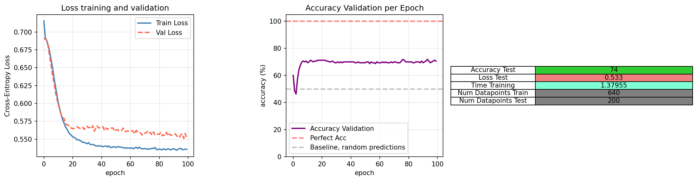
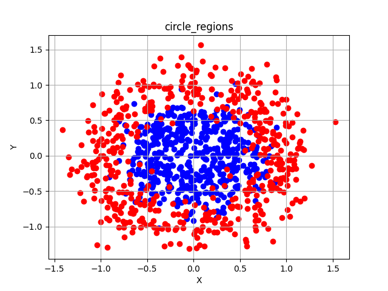
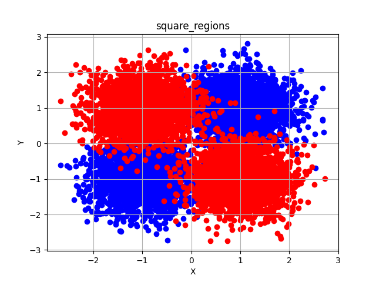

# Neural Network Package from Scratch

In this repository I try to build a basic neural network package builded from scratch for learning purposes. The objective is to really understand the mechanism of a Python package, build tests, and really learn the SGD algorithm to make future projects with larger data. I only used the following python packages to make the model and perfom operations:
1. `numpy`: All the NN structure uses numpy.
2. `pandas`: Only used to load, store datasets and save our results.
3. `matplotlib`: Used to plot and save results.

Maybe it would be fun to use only `math` as the early realese of `microgpt`. Note that making an atomic neural network it's easy. It's just a bunch of afins transformations with a non-linear function in the middle. Maybe, the hardest part is to make a SGD and being able to work with bunch of vectors. Also, I prefered to do a more complex code because then it's easier to change loss functions, applications, etc.

Other packages may be used only to load datasets and study our models performence. Moreover, we build a NN with pytorch to compare results. 

My final objective is to introduce myself into Variational Inerence and build Variational Autoencoders from scratch. I already tryed, you can see the [repository](https://github.com/mcbosch/VAE-Tutorial-Scratch). Nevertheess, the learning was strange and slow, so I want to do the basics better, so I have a more scalable project to build Variational Autoencoders.

Here we can find a good explanation on backpropagation in [*neuralnetworksanddeeplearning.com*](http://neuralnetworksanddeeplearning.com/about.html). I recomend to make the dirty work with a formal notation. I recomend it because when we attack bigger problems such as build a Variational Autoencoder, backpropagation it's not as trivial, or in case you want to scale project to a structured data and you have to design pooling layers.

# Documentation

I will write a documentation in `html` and add it in my github page. For now you can read de `documentation.md` file. 

# Results & Problems

To finish the project I had to main problems. The first was when I added the SGD option. To add a SGD I had to vectorize the model so it can work with a batch of vectors. Nevertheless, I forgot to vectorize the `to_one_hot` function. Thus the model started to fail. Moreover, I was wrinting a lot `if` because I was considering the option of working with no batch or with batch. Then I decided to consider "no batch" as a batch of size 1.

The other problem I had was adding ADAM. It's important to know that in ADAM, the variable time for the bias correction increases in every update, for every datapoint, for every epoch. I was redifining the time and the momentums at 0 for each epoch. I noticed this problem when I trained over all the mnist-dataset and noticed this:

Then I started a debbuging process, searching errors in the optimitzation function and found the ADAM problem. 

Once every problem was fixed i runed the model for my toy datasets. I used a neural network of dimensions `2-> 3-> 2` for a binary classification. I got this results for the following datasets:

 

 

Here the model makes a better training, note that in the circle regions has less datapoints. I'll make a future update with the results of the mnist-dataset. But it takes 2h for the training and testing.
## Future Updates

-   Compare with a PyTorch NN 
-   Adding binary cross-Entropy for binary classification