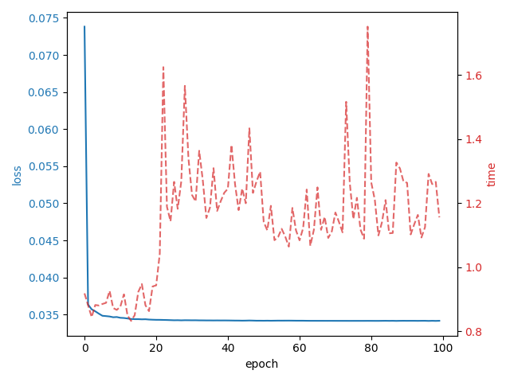
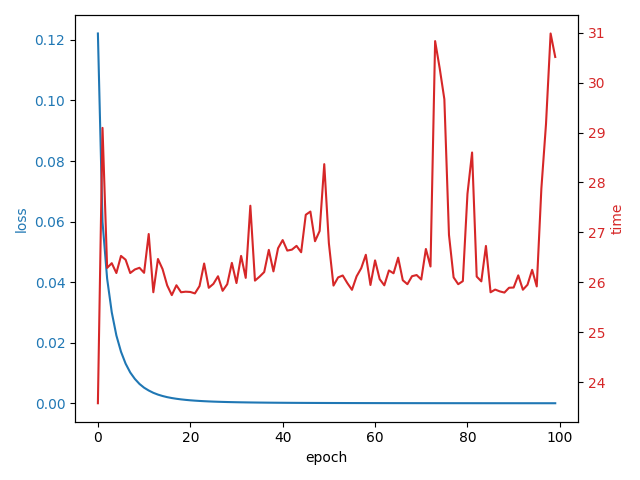

# Results; Comparing my `nn` Class and `torch.nn`

Here we analyze we compare the class we build with a `torch` neural network. I do this to analyze if it has a similar behaviour or it has poorly results. Depending on the results I'll decide on scale this project to a VAE, modify this repo, or build the VAE with torch. 

We compare the models in three cases:

1. Using basic grad descendent optimitzation. 
2. Powring backpropagation with Adaptative Momentums.
3. Using Stochastic Gradient Descendent (SGD).

## Basic Gradient Descendent

The model with a basic Gradient Descendent works perfectly but is too slow. We can see in the plots that converges rapidly either in the `toy-dataset` and the `mnist-dataset`. Nevertheless, is very time consuming. In the toy dataset it has runed over `10000` datapoints of dim `2`; and in the `mnist-dataset` over a subsample of size `6000` of fim `784`.

If we compare with the torch Neural Network (same size and activation layers), we can see the following results:
## ADAM
## SGD